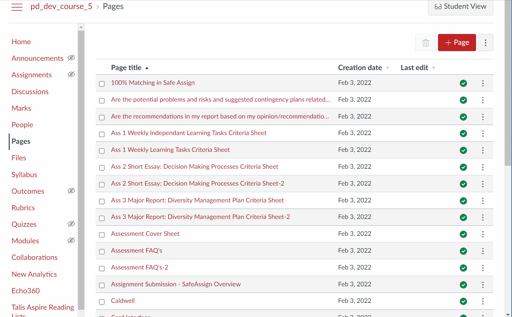

# canvas-userscripts

Nascent design for a userscript to bring together a collection of userscripts that modify the operation of the [Canvas LMS](https://www.instructure.com/en-au/canvas). With an explicit focus on helping with the management of Canvas course sites. 

## Current Status

First userscript (beta version) is up and running. More to come.

## Installation and use

1. Install a userscript manager (e.g. Tampermonkey)
2. Install [the canvas-userscripts userscript](https://github.com/djplaner/canvas-userscripts/raw/main/dist/canvas-userscripts.user.js)

## Available UserScripts

### Delete all pages

Add an option to select all of the pages in a course (and then possible de-select some) before deleting them.

For a long time, Canvas did not have an option to select multiple pages for deletion. [The community provided](https://community.canvaslms.com/t5/Canvas-Admin-Blog/Bulk-Publish-Delete-Pages/ba-p/262944) a solution using Google spreadsheets. In 2020, Canvas added a feature to do this.

However, the Canvas feature appears to require the user to select each individual page. No apparent ability to select all pages at once.
